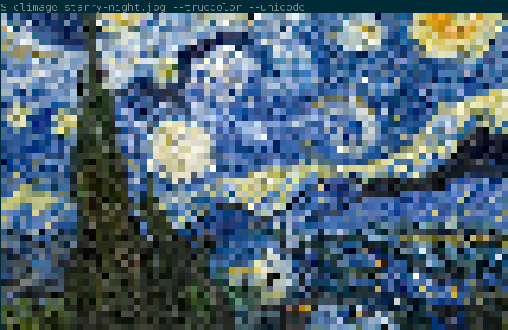
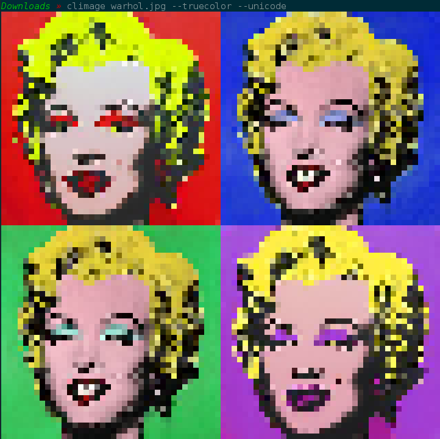
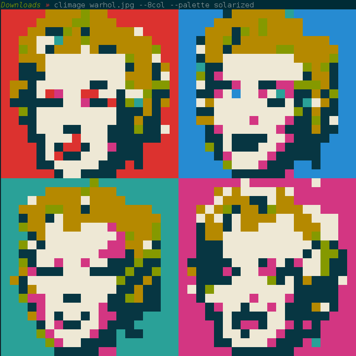
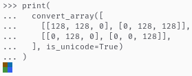
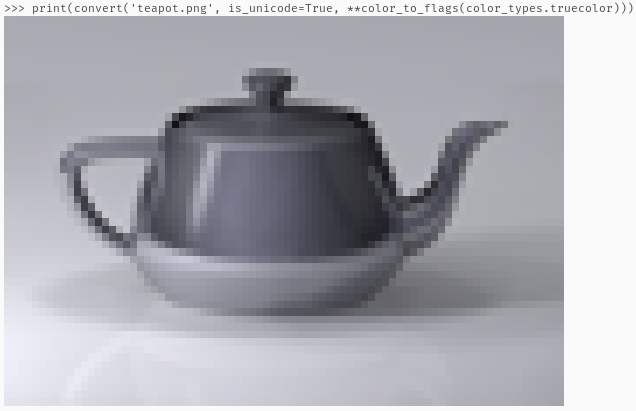
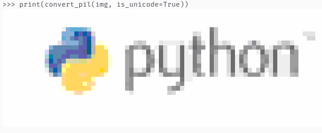

# CLImage 📷

Convert images to beautiful ANSI escape codes for display in command line interfaces.

Available as both a CLI application and a Python library.



# Features
 - Custom sized images
 - ASCII or Unicode support
    - Unicode enables 4x more detail
 - 8/16/256/Truecolor support, for a wider gamut of colors
 - Selectable system palettes to adjust for user terminal themes
 - Fast color lookup with KDTrees & memoization

# Usage

CLImage is available as both a standalone CLI program, or available for import as a Python3 library.

## CLI Program

By default converting an image will output in 256 color, as 80 columns, and ASCII (for reasonable compatibility).
```bash
$ climage image.png
```


A nicer image can be obtained when enabling unicode and truecolor flags.
```bash
$ climage --unicode --truecolour image.png
```


For display in TTYs such as the Linux terminal before starting X11 (also accessible by Ctrl-Alt-F3, etc), you should restrict yourself to 8 color, and ASCII only. As 8 and 16 colors are solely constructed out of system colors (often set by the terminal theme), it is recommended to select a palette for these, depending on what you have selected.
```bash
$ climage --8color warhol.png --palette solarized
```


Further options may be found by running `climage --help`

## Python Library

It is recommended that you use the Python library if converting a large number of images. Simple usage:

```python3
import climage

# Convert an image to a 50 character wide image.
output = climage.convert('image.png', is_unicode=True, width=50)
print(output)

# Convert an image using 8 color mode 100 columns wide, and write to file.
climage.to_file('image.png', 'out.txt', is_8color=True, width=100)
```

### Formats
The API also supports supplying a [Pillow](https://pypi.org/project/Pillow/) Image object, or a [numpy](https://numpy.org/) array representing an image.

These formats may be useful if you have already loaded from file, or are applying complex filters to the images prior to rendering.

Pillow Images can be converted via the `convert_pil` function:

```python3
import climage
from PIL import Image

# It is good practice to convert to RGB, before conversion. Climage supports
# RGBA also, but will render as if the alpha channel is completely opaque.
# Attempting to convert greyscale or other formats (e.g. RBG) will fail, or
# present an invalid result.
img = Image.open('image.png').convert('RGB')
output = climage.convert_pil(img, is_unicode=True)
print(output)
```

Similarly, numpy arrays are converted using the `convert_arr` function. In the example below we use Pillow to generate the numpy array, but any row-major array whose element represents an RGB triplet. Each colour is represented by a number in the range [0,255].

```python3
import climage
from PIL import Image

# Convert the image into 50px * 50px, as the convert_array function does not
# perform resizing.
img = Image.open('image.png').convert('RGB').resize((50, 50))
arr = np.array(img)
output = climage.convert_array(arr, is_unicode=True)
print(output)

```

Python lists are also accepted:

```
from climage import convert_array

# Simple 2x2 image showing raw python lists are usable too.
print(
  convert_array([
    [[128, 128, 0], [0, 128, 128]],
    [[0, 128, 0], [0, 0, 128]],
  ], is_unicode=True)
)
```

Output:



### Helpers

To provide you more expressiveness and flexibility, various helper methods are exposed.

```python3
from climage import color_to_flags, color_types, convert

# color_to_flags allows you to easily define the color option required by
# convert. Accepts a value from the `color_types` enum, which has the following
# options:
#   - color_types.truecolor
#   - color_types.color256
#   - color_types.color16
#   - color_types.color8
print(convert('teapot.png', is_unicode=True, **color_to_flags(color_types.truecolor)))

```

Output:



```python3
from climage import get_ansi_pixel, get_reset_code, color_types

# get_ansi_pixel lets you to convert an RGB color to the ANSI escape code
# sequence for representing that colour as a pixel. Similar to the convert
# functions, by default converts using a 256 color palette, and does not use
# the unicode characters.
# This call will print 2 characters wide, as it is not unicode.
pix = get_ansi_pixel(
  # Violet
  (148, 0, 211),
  ctype=color_types.truecolor,
)
# If you are printing this pixel singularly, you will want to reset the color
# back to normal. If you are wishing to print a bunch sequentially (as in, on
# the same line), you should append the reset code at the end.
print(pix + get_reset_code())
```

Output:


```python3
from climage import get_dual_unicode_ansi_pixels, get_reset_code, color_types

# get_dual_unicode_ansi_pixels is the unicode character equivalent of
# get_ansi_pixel. This accepts two colours, one for the upper pixel, and one
# for the bottom pixel.
pixels = get_dual_unicode_ansi_pixels(
  # Green
  (0, 128, 0),
  # Red
  (128, 0, 0),
  ctype=color_types.color256,
  palette="solarized",
)
print(pixels + get_reset_code())
```

Output:


### Additional interfacing
As `climage` can convert arbitrary images in memory, converting images on the Internet is possible using the `requests` library:

```python3
import requests
import climage
from io import BytesIO

response = requests.get('https://www.python.org/static/community_logos/python-logo-master-v3-TM-flattened.png')
# Convert to RGB, as files on the Internet may be greyscale, which are not
# supported.
img = Image.open(BytesIO(response.content)).convert('RGB')
# Convert the image to 80col, in 256 color mode, using unicode for higher def.
converted = climage.convert_pil(img, is_unicode=True)
print(converted)
```

Output:



Note that caching the image may be more efficient for multiple invocations.

# Future:
 - [ ] Improve performance in 256 color mapping, see [here](https://github.com/pnappa/CLImage/issues/1)
 - Ideas? Let me know by filing an issue. :)

